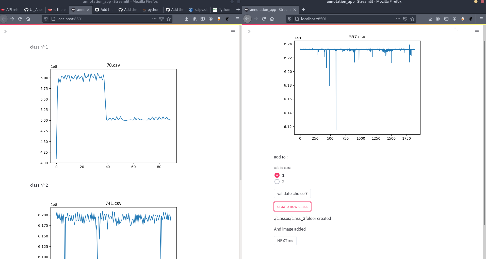

# Interface graphique pour la labelisation d'images 

Objectif 
========

Cette interface a pour objectif de simplifier la labelisation des images de séries temporelles afin de pouvoir ensuite entrainer des modèles de classifications supervisés.

Exemple interface
=================



La page classification montre les images une par une à l'utilisateur.  
L'utilisateur a alors le choix de l'ajouter dans une classe éxistante ou de créer une nouvelle classe.  
La page classes permet à l'utilisateur de voir une image de chaque classe afin de pouvoir l'aider à se rappeler du type d'éléments contenu dans chaque classe.  
A chaque fois l'utilisateur doit appuyé sur "next =>" pour charger l'image suivante.  
ATTENTION à ne pas appuyer deux fois sur "validate choice" ou "create new class" sinon l'operation sera éffectué sur l'image d'après.

Utilisation 
=========== 

Une fois la branche cloné il faut : 
- Creer un dossier "classes"  
- Creer un fichier "classified"  

A chaque fois que l'utilisateur crée une nouvelle classe, un dossier nommé "class_i" est crée dans le dossier "classes" avec i le nombre de classe déjà existante + 1.  
Il crée égalmeent un fichier "num.txt" contenant le nombre de nombre d'image déjà labélisée.
Dans chaqu'un des dossiers "class_i", une copie de l'image en question sera ajouté.    
Une fois l'image classifié, elle est déplacé du dossier "img" au dossier "classified".  
Le programme continue jusqu'a ce que le dossier "img" soit vide.

Lancement :
========== 
Le programme nécéssite la librairie streamlit installable via pip.
Une fois installé, se placer dans le dossier racine 
taper :
```
streamlit run annotation_app.py
```

Le page est alors accessible à l'adresse :  http://localhost:8501

